**概述**

- 项目名称：创客空间官网
- 作者/团队信息 神乐和邓婷
- 日期 24/4/9

**部署准备**

- Linux
- idea2023（建议新一点吧）
- 宝塔系统
- mysql8.0 （不建议5.7）
- jdk:17
- node.js（不是太老的就行，我用的是20.5.1）

**获取代码**

- 代码仓库地址
- 获取代码的方法（Git clone、下载压缩包等）

[Kaguranotamashii/club_demo (github.com)](https://github.com/Kaguranotamashii/club_demo)

# 本地部署

## 获取代码

通过GitHub clone代码至本地目录，或者选择下载压缩包方式获取代码。

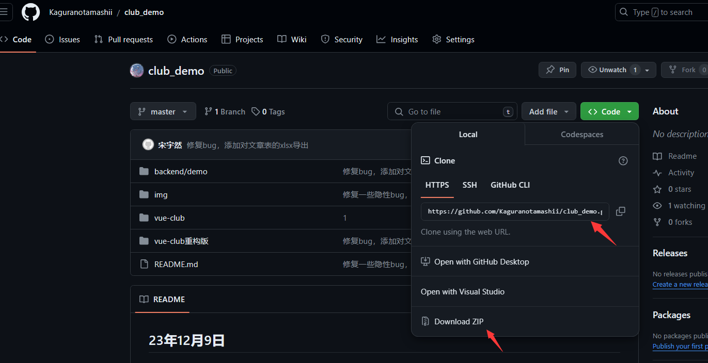

这里两种方法都可以

我这里就选择下载Download zip吧

## 导入项目

- 打开IDEA，选择打开项目目录。

- 建议使用最新版本的IDEA，因为新版本的界面更加舒适。

  

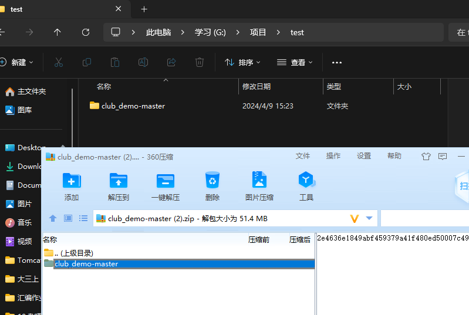


打开idea，打开项目目录。

个人还是建议用最新版本吧，新版本的idea的ui更舒服。

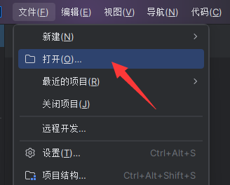


打开后界面如下，如果提示找到maven构建脚本，点击加载、

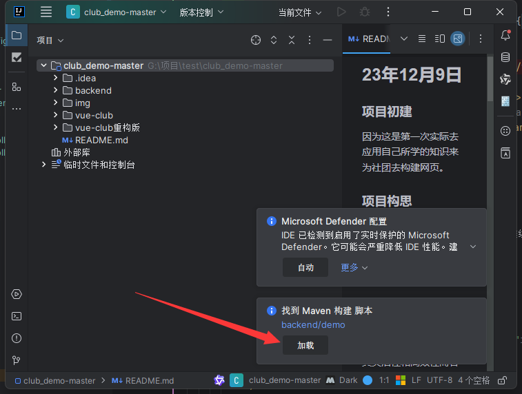


## 前端项目

### 下载Node模块

在前端项目vue-club重构版终端输入以下命令：

```
npm install
```

（未来迭代可能不是这个名字了）下载node_moudle，下载速度看网速，校园网我是用了不到一分钟


### 运行前端项目


运行成功后，访问 http://localhost:5173/ 即可打开项目。

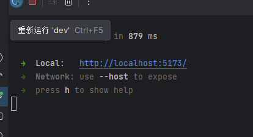

打开后提示服务异常就是后端没打开，接下来我们打开后端项目

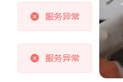

## 后端项目

### 数据库

导入数据库的软件有很多但是这里我选择用idea自带的管理数据库


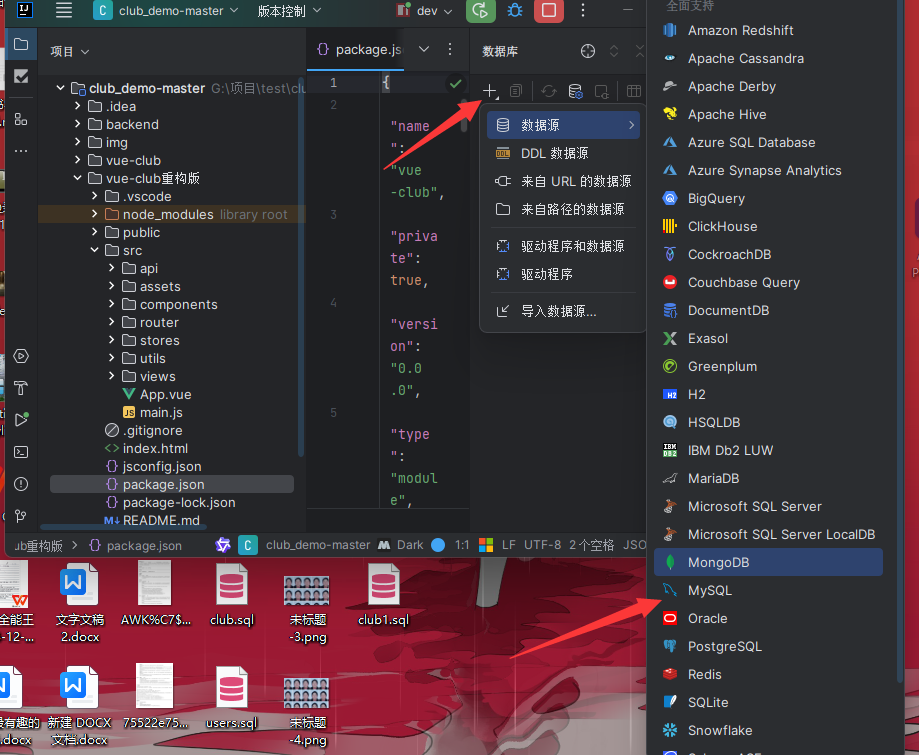

输入本地mysql数据库和密码账号测试连接


将sql.sql的文件复制到这里，运行，选择执行全部


数据库加载完成


### Spring Boot项目配置

修改项目配置文件（application.yml），确保数据库连接等配置正确。


```yml
spring:
  datasource:
    driver-class-name: com.mysql.cj.jdbc.Driver
    url: jdbc:mysql://localhost:3306/club?erverTimezone=CST
    username: root
    password: 123456


  data:
    resources:
      static-locations: classpath:static/
  servlet:
    multipart:
      max-file-size: 5MB

mybatis:
  configuration:
    map-underscore-to-camel-case: true #开启驼峰命名和下划线命名的自动转换
    log-impl: org.apache.ibatis.logging.stdout.StdOutImpl
server:
  port: 8080


upload:
  location:
    os: G:/项目/社团官网/源代码/backend/demo/target/classes/static/images
    os1: G:/项目/社团官网/源代码/backend/demo/target/classes/static

----------分割线---------
数据库配置一定要修改正确的，否则会报错


上传文件的目录的话选做吧，因为没有目录会在本地生成。这一步在
项目的本地目录为
G:/项目/test/club_demo-master/backend/demo （\括号需要换成/）
所以只要把路径放在最前面然后加上/target/classes/static/images
upload:
  location: G:/项目/test/club_demo-master/backend/demo/target/classes/static/images
  upload:
  location:
    os:  G:/项目/test/club_demo-master/backend/demo/target/classes/static/images
    os1:  G:/项目/test/club_demo-master/backend/demo/target/classes/static

```

### 运行

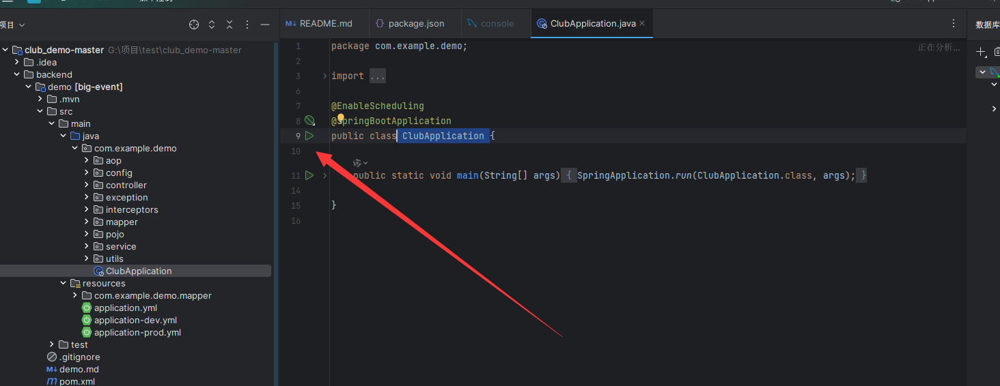


本地运行后端项目，确保前端项目不再报错，即可登录后台进行管理。

账号admin

密码123456


# 服务器部署

您提到了需要一台云服务器，以下是服务器部署步骤：当然云服务器的购买这里不讨论，2g2核就足够了


## 安装数据库

宝塔对2g内存限定在mysql5.7的版本，但是可以绕过宝塔去安装mysql8.0 可参考这篇博客

[宝塔面板强制安装 MySQL8.0_宝塔安装mysql8.0-CSDN博客](https://blog.csdn.net/qq_26572789/article/details/134192664)


### 创建数据库

使用phpMyAdmin等工具创建数据库，并导入项目提供的SQL文件。

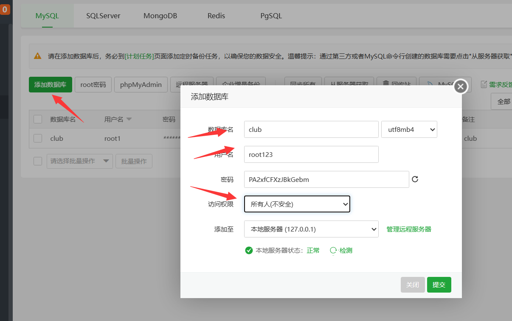

打开phpMyadmin


### 导入数据库

选择文件选项目里面的sql.sql

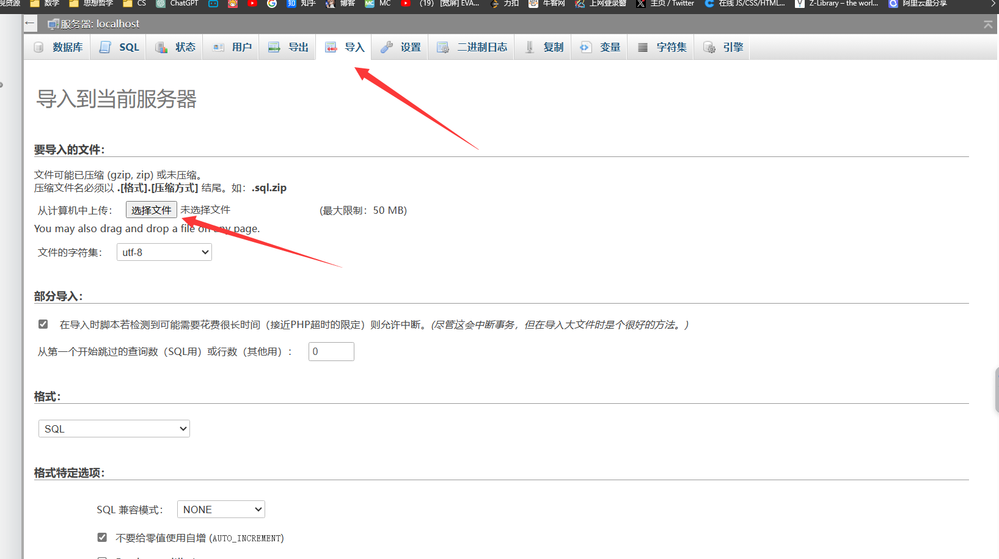

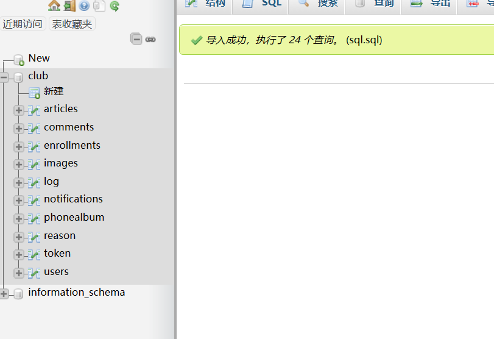

## 后端

### 打包本地项目为jar包

使用IDEA打包后端项目为JAR包，并上传至服务器。


jar包的地址在后端目录下的target根目录下

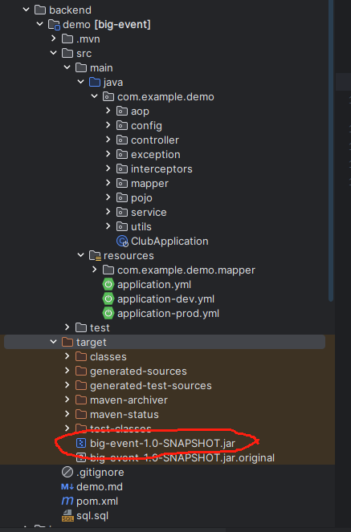

### 上传后端打包文件

确保已经修改好后端配置文件（application-prod.yml），然后将JAR包上传至服务器。

请事先打开addlication-prod文件，修改线上部署的mysql地址以及密码和账号，upload这个别碰

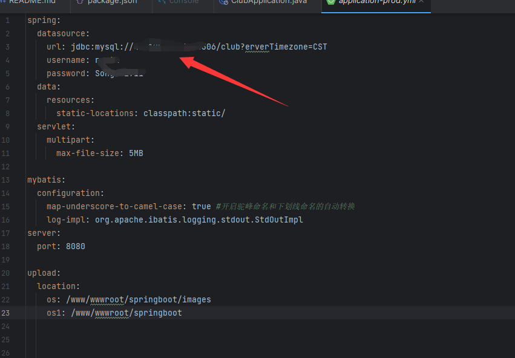

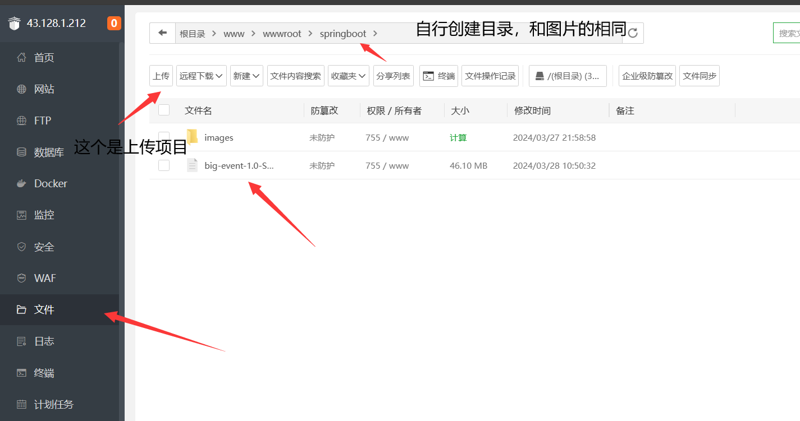

### java环境

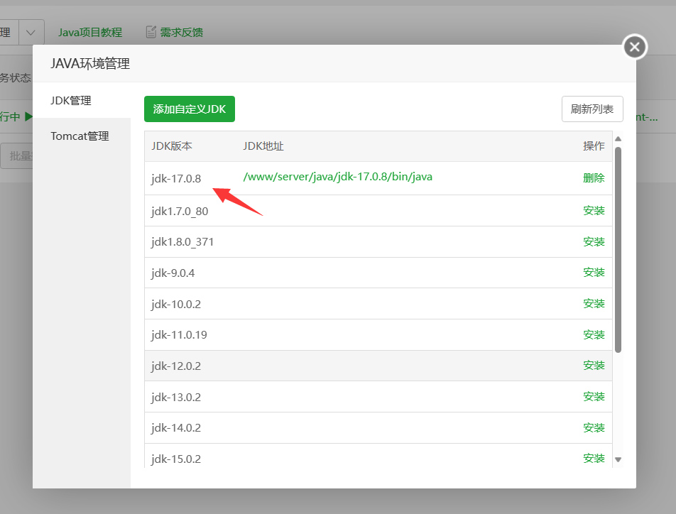

### 添加java项目

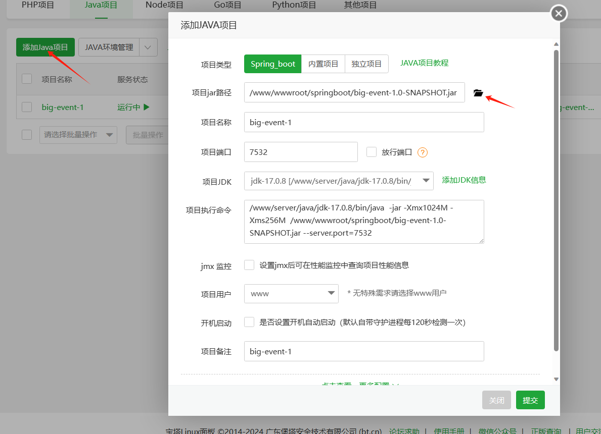

一定要注意

- 端口号为8080并且放行端口
- 项目执行命令 要加上--spring.profiles.active=prod
- 开机启动勾上

大概就是这个样子


```
/www/server/java/jdk-17.0.8/bin/java  -jar -Xmx1024M -Xms256M  /www/wwwroot/springboot/big-event-1.0-SNAPSHOT.jar --server.port=8080 --spring.profiles.active=prod
```


注意如果启动后服务状态还是已停止之类的，很有可能是项目启动失败了

这里可以看项目运行状态，可以判断是哪里出了问题


## 前端

根据服务器的公网，在前端项目需要更改两项


### Vite配置文件（vite.config.js）

```javascript

  // 服务器配置项
  server: {
    // 代理设置
    proxy: {
      // 将对'/api'的请求代理到指定的目标地址
      '/api': {
        target: 'http://localhost:8080',
        // 可以根据需要切换到不同的目标地址
        changeOrigin: true, // 是否改变源地址
        // 请求路径重写规则，将'/api'开头的路径去除'/api'
        rewrite: (path) => path.replace(/^\/api/, '')
      }
    }
  }
//这里请将target修改为 http://{公网ip}:8080
//公网ip如124.70.107.100
//一定要加上8080端口
```


### baseURL.js配置文件


```javascript
// export const baseURL = 'http://kaguranosoul.xyz/';
// export const baseURL = 'http://124.70.xxx.226:8080'
export const baseURL = 'http://localhost:8080'
//这里就直接用公网就可以了
//这边的是用来拼接图片的，从后端图片数据库里面的图片路径进行拼接
```


### 打包上传

package.json


文件在前端项目的dist里面


将项目放到云服务的以下目录下

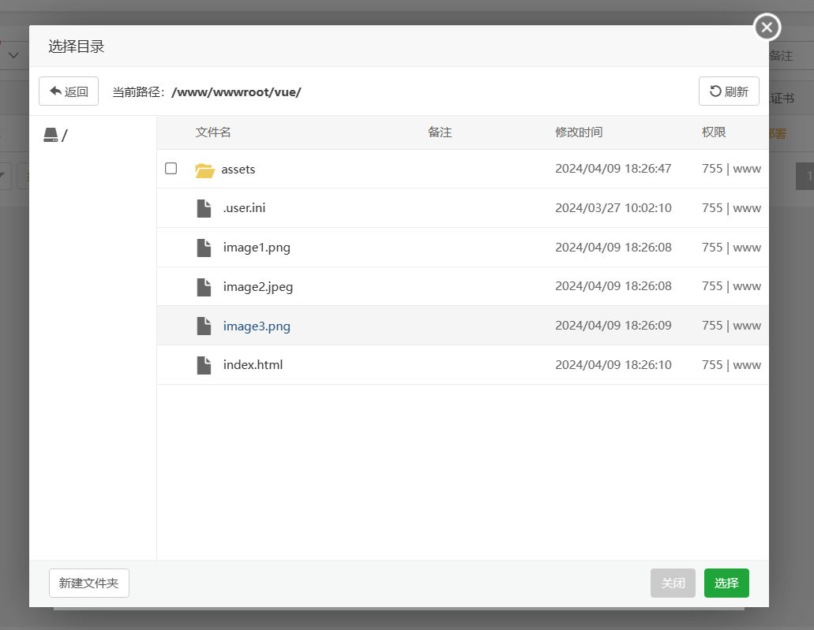


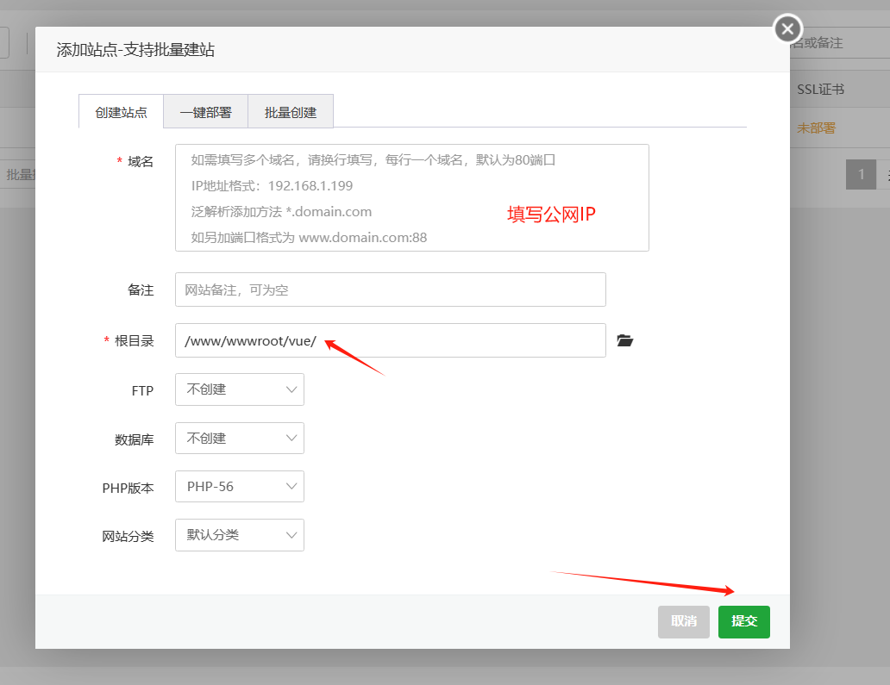

启动后就可以通过公网ip直接访问项目了，而且后面不用加上80端口，是默认的。

### NGINX配置

打开公网就能访问前端项目了，但是发现跳转路由都回到了首页这里是vue路由设置的问题，需要对nginx进行代理

https://m.jb51.net/article/242934.htm

需要打开前端配置加入

```
location / {
  try_files $uri $uri/ @router;
  index index.html;
}
 
location @router {
  rewrite ^.*$ /index.html last;
}
```


# 域名

域名的话随便搞个来，然后这里有个坑，国内服务器挂域名是需要备案的，太麻烦了我都没搞懂呢现在，所以我用的是香港服务器，这里假设已经域名绑定ip了。具体怎么操作就不多说了。


 


打开域名发现已经可以通过域名进入网页了

这里还有两个问题需要去修改，其实也不是什么问题了

如果按照这个去访问，会发现打开的图片路径暴露了公网，这会导致攻击的风险，要通过反向代理来屏蔽公网

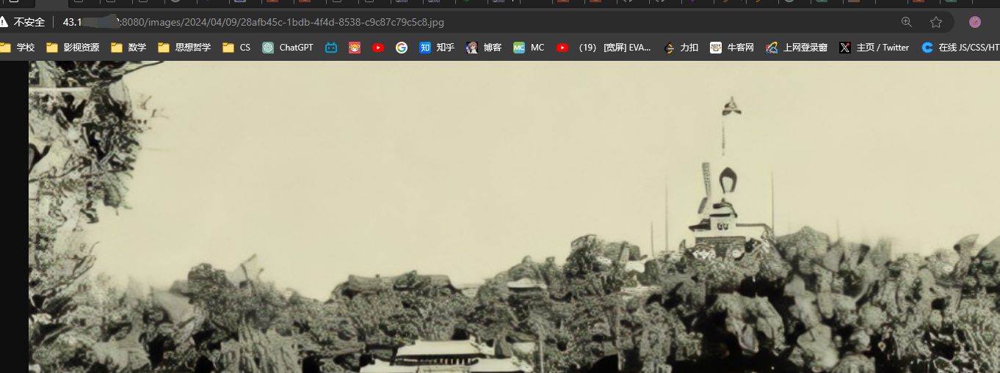


## NGINX代理

```
        location ^~ /api/ {
            rewrite  ^/api/(.*)$ /$1 break;
            proxy_pass http://127.0.0.1:8080/;
        }
            location ^~ /images/ {
            rewrite  ^/api/(.*)$ /$1 break;
            proxy_pass http://127.0.0.1:8080/images/;
        }
```

在之前修改路由的配置文件下加入这两行，是反向代理意思是

8080端口变成api端口就能访问

图片端口路径可以通过images直接访问

## 前端

baseURL.js修改为

```javascript
export const baseURL = 'http://kaguranosoul.xyz';

//这里是就是域名了
```

vite.congig.js

```javascript
  server:{
    proxy:{
      '/api':{
        // target:'http://localhost:8080',
        target:'http://kaguranosoul.xyz/api',//这里是域名加上/api
        changeOrigin:true,
        rewrite:(path)=>path.replace(/^\/api/,'')///api替换为''
      }
    }
  }
```

打包上传项目


# 注意

如果有什么问题可以联系我或者在这里补充完善。
## 关于怎么pull项目
idea里面左档有个题交，只要有改动就点击全部更改，然后写更细记录，提交并推送，强制提交更新。
